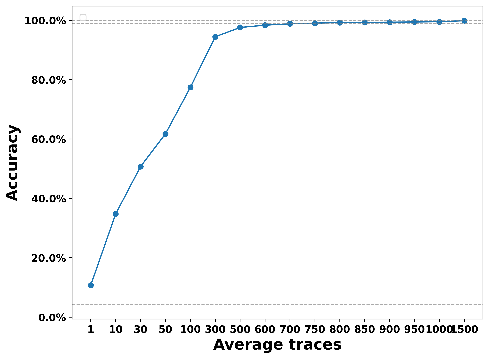

# System-level time computation and representation in the suprachiasmatic nucleus revealed by large-scale calcium imaging and machine learning

> [**System-level time computation and representation in the suprachiasmatic nucleus revealed by large-scale calcium imaging and machine learning**]
> **under review** <br>
> Zichen Wang†, Jing Yu†, Muyue Zhai, Zehua Wang, Kaiwen Sheng, Yu Zhu, Tianyu Wang, Mianzhi Liu, Lu Wang, Jue Zhang, Ying Xu, Xianhua Wang, Lei Ma*, Wei Hu*, Heping Cheng* <br>

This repository contains the implementation for the paper [System-level time computation and representation in the suprachiasmatic nucleus revealed by large-scale calcium imaging and machine learning]. 

## The SupraChiasmatic Nucleus
 **(<font color="red">replace the fig here.</font>)**
<div  align="center">    
 
</div>

> The suprachiasmatic nucleus (SCN) is a bilateral structure located in the anterior part of the hypothalamus. It is the central pacemaker of the circadian timing system and regulates most circadian rhythms in the body. **(<font color="red">add more information here.</font>)**

## How to run the code
### 1. Dependencies
Before running our codes, please make sure you have installed conda/miniconda and use the following commands to install the requirements.
```shell script
conda env create -f torch.yml
``` 

### 2. Datasets
We have SCN Ca2+ wave data from six different mice, and all experimental analyses, including the time predictor, rely on these data to be completed. We provided the full data in the following link 
[SCNdata_link](https://github.com/tqch/ddpm-torch/releases/download/checkpoints/cifar10_2040.pt)
**(<font color="red">add more information here and the download link of SCN data.</font>)**

Download the SCN data and put them in ```./SCNData ``` folder.

### 3. TimePredictor
#### 3.1 Definition:
(1) **general time predictor $f_{n}$**: this model is trained on the full training dataset. For example, one model is trained on the training dataset of ```Dataset1_SCNProject.mat```, we name it as general time predictor $f_{1}$.

(2) **submodule time predictor $g_{n}$**: this model is trained on a splitted dataset. For example, one model is trained on the training dataset of the **spatial class 1** in ```Dataset1_SCNProject.mat```, we name it as submodule time predictor $g_{1}$. As shown in the FigS8, we have trained separately on three training dataset of the **spatial class 1, 2, 3** in ```Dataset1_SCNProject.mat```.

#### 3.2 code introduction.
(1) For general time predictor, we provide its full training and testing pipeline in folder ```./TimePredictor```. And we also provided the code for general time predictor testing on sub-spatial modules in the same folder. 
(2) For submodule time predictor, we provide its full training and testing pipeline in folder ```./SubModule_TimePredictor```..

#### 3.2 training and testing.
##### 3.2.1 general time predictor.
```
cd TimePredictor
python train.py

python test_on_FullTestSet.py             # test on the full test set.

python test_on_SubModuleInFullTestSet.py  # test on the submodule in the full test set.
```

##### 3.2.2 submodule time predictor.
$g_{n}$ is trained on one spatial submodule, then test on its own testset and other two submodule.
```
cd SubModule_TimePredictor
python train_1for3.py

python training_base_1for3.py  
```

### 4. Attribution Analysis.

```
cd attribution_analysis
python train.py

python test_AttributionAnalysis.py
```


### 5. TraceContrast.

```
cd TraceContrast

```